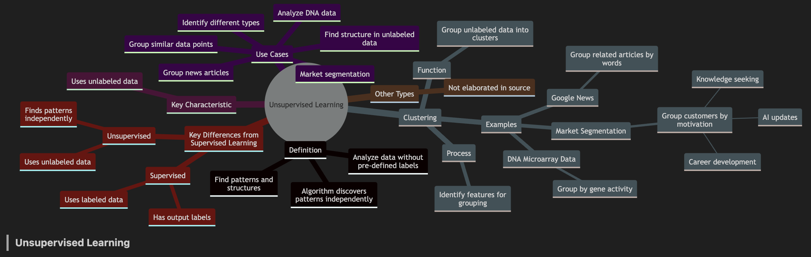
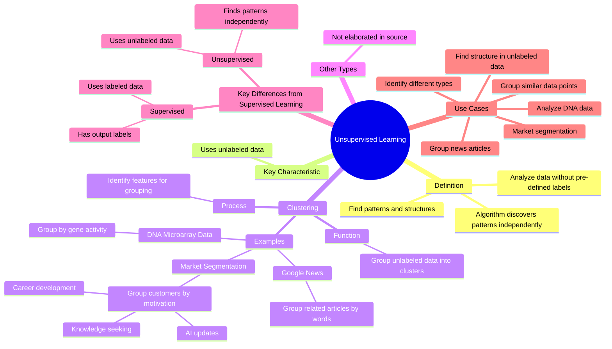

**Unsupervised Learning**

*   **Definition:** A type of machine learning where algorithms analyze data without pre-defined output labels. The goal is to find patterns, structures, or something interesting in the data. The algorithm is not "supervised" with correct answers; instead, it must figure out interesting patterns on its own.
*   **Key Characteristic:** Unlike supervised learning, unsupervised learning uses data that is not associated with any output labels.

*   **Clustering:** A specific type of unsupervised learning algorithm.
    *   **Function:** It groups unlabeled data into distinct clusters or groups.
    *   **Examples:**
        *   **Google News:** Clustering is used to group related news articles together by finding articles that use similar words.
        *   **DNA Microarray Data:** Clustering is used to group individuals based on their gene activity.
        *   **Market Segmentation:** Clustering is used to group customers into market segments. For example, a deep learning team used clustering to understand why different individuals take their courses. They identified groups based on motivation: seeking knowledge, career development, and staying updated on AI.
    *   **Process**: The algorithm identifies which features suggest that certain data should be in the same group without explicit instructions to look for those features.

*   **Other Types of Unsupervised Learning**: The source suggests that there are other types of unsupervised learning algorithms, but does not elaborate.

**Key Differences from Supervised Learning**

*   **Supervised Learning:** Uses labeled data, where each example is associated with an output label. The algorithm is "supervised" to give the correct answer for every input.
*   **Unsupervised Learning:** Uses unlabeled data, where no output labels are given. The algorithm figures out patterns by itself.

**Use Cases**

*   Finding structure in unlabeled data.
*   Grouping similar data points.
*   Identifying different types of individuals or items in the data.
*   Market segmentation.
*   Analyzing DNA data.
*   Grouping news articles.

---

