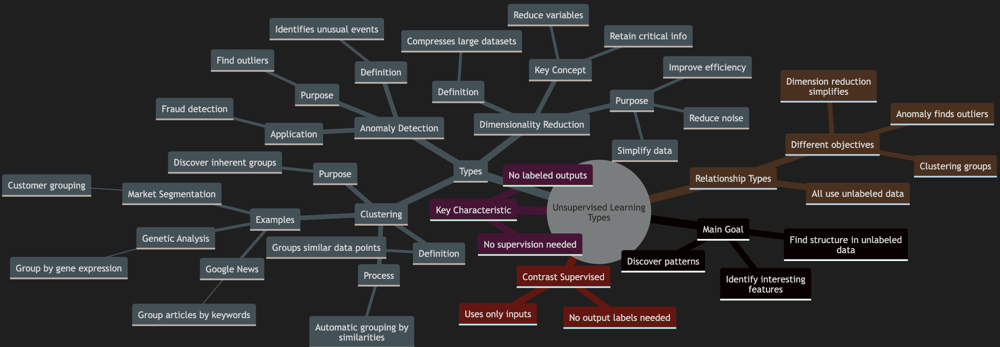
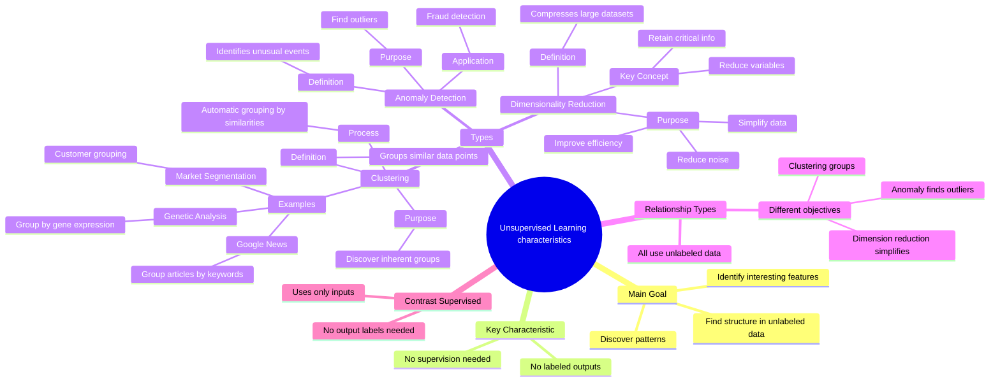

**Unsupervised Learning types**

*   **Main Goal**: To find structure, patterns, or interesting features in data without output labels.
*   **Key Characteristic**: Algorithms operate without supervision and labeled outputs.

    *   **Clustering**
        *   **Definition**: Groups similar data points together into clusters.
        *   **Process**: The algorithm automatically identifies and groups data based on similarities, without being told what the groups should be.
        *   **Purpose**: To discover inherent groupings within the data.
        *   **Examples**:
            *   **Grouping News Articles**: Google News uses clustering to group similar articles together based on shared keywords, such as 'panda,' 'twin,' and 'zoo' in the same cluster.
            *   **Market Segmentation**: Companies use clustering to group customers into different market segments to serve them more efficiently.
            *   **Genetic Data Analysis**: Grouping individuals based on similar genetic expressions.
    *  **Anomaly Detection**
        *   **Definition**: Identifies unusual events or data points that deviate significantly from the norm.
        *   **Purpose**: To find outliers or rare occurrences.
        *   **Application**: Fraud detection in financial systems, where unusual transactions might indicate fraudulent activity.
    *   **Dimensionality Reduction**
        *   **Definition**: Compresses large datasets into smaller datasets while retaining essential information.
        *   **Purpose**: To simplify the data, reduce noise, and improve efficiency of subsequent analysis.
        *   **Key Concept**: Reduces the number of variables in the dataset without losing critical information.

*   **Relationship between Types**:
    *   All three types fall under the umbrella of unsupervised learning, where the data lacks output labels.
    *   Each type has a unique objective within unsupervised learning: clustering groups, anomaly detection finds outliers, and dimensionality reduction simplifies datasets.

*   **Contrast to Supervised Learning:**
    *   Supervised learning uses data with both inputs (x) and output labels (y), unlike unsupervised learning which only uses inputs.

---

