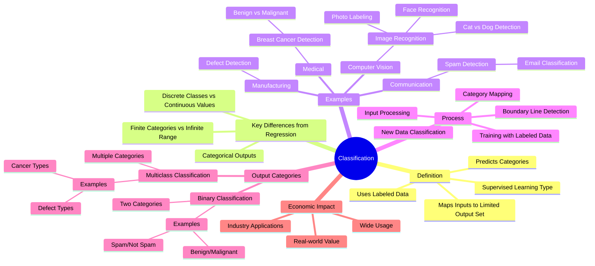

**Central Topic:** Classification (a type of supervised learning)

* **Definition**:
    * A type of supervised learning where the algorithm predicts categories.
    * The algorithm learns to map inputs to a limited set of output categories.
    * Uses labeled data, which provides "correct answers" for the algorithm to learn from.

* **Key Difference from Regression**:
    * Regression predicts numbers from an infinite range of possible values.
    * Classification predicts from a small, finite set of categories.
    * Categories can be numeric (e.g., 0, 1, 2) but are treated as distinct classes rather than continuous values.

* **Examples**:
    * **Breast Cancer Detection**:
        * Classifying a tumor as either benign or malignant.
    * **Spam Detection**:
        * Classifying emails as either spam or not spam.
    * **Image Recognition**:
        * Determining if a picture contains a cat or a dog.
        * Recognizing faces in images.
        * Labeling friends in photos.
    * **Defect Detection**:
        * Identifying defects in manufactured products.
    * **Other**:
        * Voice to text on phones, voice assistants like Siri and Google, and online advertising can utilize classification algorithms.

* **Process**:
    * The algorithm is trained with labeled data.
    * Input data can consist of one or multiple values, for example, tumor size and patient age for a cancer detection task.
    * The algorithm learns to map input to the correct categories based on the training data.
    * The trained algorithm can then classify new, unseen inputs into the defined categories.
    * The algorithm attempts to find a boundary line that separates out different output categories.

* **Output Categories**:
    * Can be two categories (binary classification).
        * For example, benign or malignant, spam or not spam.
    * Can be more than two categories (multiclass classification).
        * For example, different types of cancer, or types of defects.

* **Economic Impact**:
    * Supervised learning, including classification, creates significant economic value.
    * It is widely used in many real-world applications.
    * Classification algorithms are essential in many industries.
