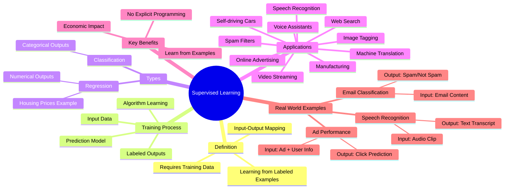

```mermaid
mindmap
  root((Supervised Learning))
    Definition
      Learning from Labeled Examples
      Input-Output Mapping
      Requires Training Data
    Training Process
      Input Data
      Labeled Outputs 
      Algorithm Learning
      Prediction Model
    Types
      Regression
        Numerical Outputs
        Housing Prices Example
      Classification
        Categorical Outputs
    Applications
      Spam Filters
      Speech Recognition
      Machine Translation
      Online Advertising
      Self-driving Cars
      Manufacturing
      Image Tagging
      Web Search
      Voice Assistants
      Video Streaming
    Key Benefits
      No Explicit Programming
      Learn from Examples
      Economic Impact
    Real World Examples
      Email Classification
        Input: Email Content
        Output: Spam/Not Spam
      Speech Recognition
        Input: Audio Clip
        Output: Text Transcript
      Ad Performance
        Input: Ad + User Info
        Output: Click Prediction
```